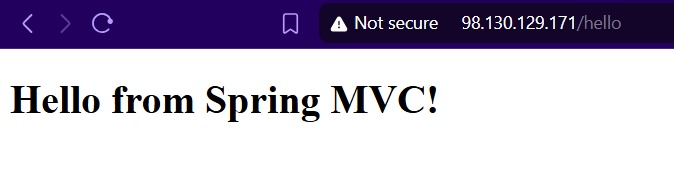

# 🚀 Terraform EC2 Java App Deployment with Auto-Shutdown + S3 Log Archival

This project provisions an EC2 instance using Terraform to deploy a Java-based application. The instance auto-shuts down after a configurable time and uploads logs to a private S3 bucket.

---

## 📁 Project Structure

```
.
├── LICENSE
├── Scripts
│   └── user_data.sh              # Bootstraps EC2: Installs Java, clones repo, builds, runs app, uploads logs, shuts down
├── Terraform
│   ├── backend.tf                # (Optional) Remote state backend config
│   ├── dev.tfvars                # Dev environment variables
│   ├── iam_instance_profile.tf   # IAM instance profiles
│   ├── iam_roles.tf              # IAM roles and policies (S3 upload-only, S3 read-only)
│   ├── main.tf                   # Main resources (EC2, IAM, SG)
│   ├── outputs.tf                # Useful outputs
│   ├── prod.tfvars               # Prod environment variables
│   ├── provider.tf               # AWS provider
│   ├── s3.tf                     # S3 bucket and lifecycle rules
│   └── variables.tf              # Input variables
├── assets
│   └── result.jpg                # Screenshot of app running on EC2
└── policies
    └── ec2_policy.json           # Custom IAM policy for EC2
```

---

## 📦 Features

- EC2 instance with IAM roles and instance profiles
- Open ports: `80` for HTTP and `22` for SSH
- Auto installs Java 21, Maven, Git, AWS CLI
- Clones and runs Java app from GitHub
- Uploads system and app logs to private S3 bucket after shutdown
- Adds lifecycle policy to delete logs after 7 days
- Includes read-only EC2 instance for verifying S3 access

---

## 🔧 How to Use

1. **Set up AWS credentials** (via environment or `~/.aws/credentials`).
2. **Initialize Terraform**:
   ```bash
   cd Terraform
   terraform init
   ```

3. **Apply for Dev environment**:
   ```bash
   terraform apply -var-file=dev.tfvars
   ```

4. **Apply for Prod environment**:
   ```bash
   terraform apply -var-file=prod.tfvars
   ```

---

## 📄 Sample `dev.tfvars`

```hcl
env             = "dev"
ami_id          = "ami-0c1234567890abcde"
instance_type   = "t2.micro"
key_name        = "my-key"
vpc_id          = "vpc-xxxxxxxx"
subnet_id       = "subnet-xxxxxxxx"
script_path     = "../Scripts/user_data.sh"
policy_path     = "../policies/ec2_policy.json"
s3_bucket_name  = "my-logs-bucket-for-dev-999"
```

---

## 🌐 Application Preview



---

## 📜 License

Apache License 2.0